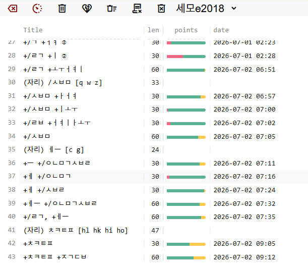
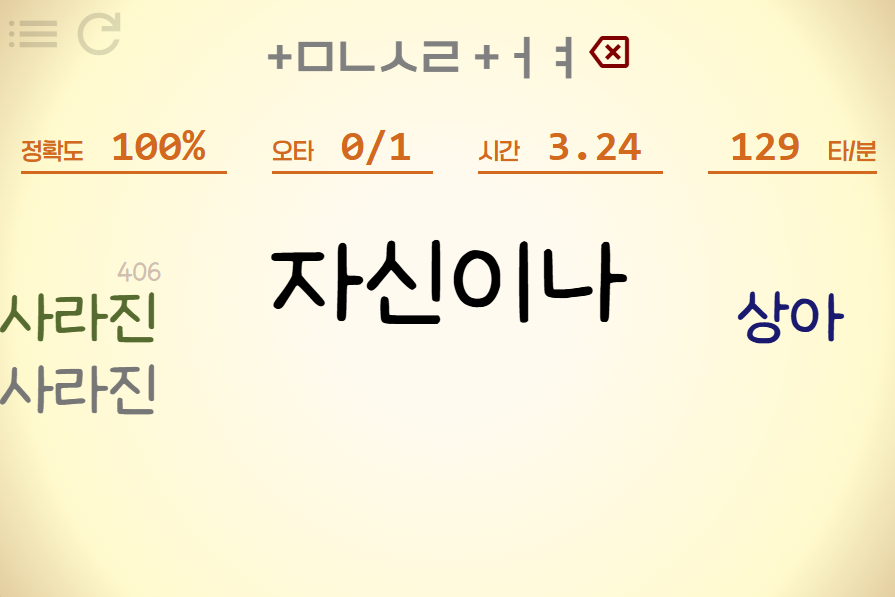

# typepractice

A Korean word based typing practice application built with Rust and Dioxus.

This project is designed for practicing Korean keyboard layouts through a structured curriculum. It currently provides built in curricula for 공380 and 세모e2018ㅗ

The application is available as both a native desktop application and a web version.

Web version:
https://bivoje.github.io/typepractice/

## Motivation

I created this project to make it easier to learn three-set Korean keyboard layouts one key at a time.

Instead of practicing with random words from the beginning, the curriculum gradually introduces new key positions while continuously reviewing previously learned ones. This approach is especially useful for 세모e, where learning 모아쓰기 is much more demanding.

At the time of development, I could not find a web based service that supported this style of practice for 세모e2018, so I built one.

The curriculum design was inspired by edclub.

## Features

* Word based Korean typing practice
* Structured curriculum for 공380
* Structured curriculum for 세모e2018
* Gradual introduction of new key positions
* Continuous review of previously learned keys
* Configurable practice options
* Native desktop application
* Web version available in the browser

## Screenshots

### Practice List



### During Practice



## Installation

Prebuilt binaries are currently available for Windows x64 only.

Download the latest release and either:

* Run the installer.
* Use the portable version.

## Build

Use dioxus-cli for build the project

```
# installing dioxus-cli using cargo-binstall
cargo binstall dioxus-cli --force
```

For desktop version,
```
dx bundle --relase
```
then serch `target/dx/typepractice/release/app` for portable version, `target/dx/typepractice/bundle` for installer.

For web version
```
dx build --release --web
```
then serch `target/dx/typepractice/release/web/public`.

## Usage

When the application starts, the practice list is displayed.

The controls in the upper left corner allow you to configure practice options before starting.

Available options include:

* Selecting the curriculum
* Allowing or disallowing Backspace
* Measuring the interval between typed words
* Deleting practice scores

Choose a lesson from the list to begin practicing.

## Korean Summary

typepractice는 Rust와 Dioxus로 만든 한글 단어 단위 타자 연습 프로그램입니다.

세벌식 자판을 자리별로 조금씩 익힐 수 있도록 커리큘럼 기반의 학습 방식을 제공합니다. 현재 공380과 세모e2018 커리큘럼을 기본 제공하며, 새로운 자리를 하나씩 배우면서 이전에 익힌 자리도 함께 반복 연습할 수 있습니다.

네이티브 데스크톱 프로그램과 웹 버전을 모두 지원합니다.

Windows x64용 실행 파일을 Release에서 받을 수 있으며, 직접 빌드하려면 Dioxus CLI를 설치한 뒤 다음 명령을 실행하면 됩니다.

```bash
dx build --desktop
```

## Credits

This project uses '학교안심 알림장', '오뮤 다예쁨체' and 'Google Material Symbols' fonts.

This project uses gatherd text from:
- 공선당 선언 translated on wikidocs [link](https://ko.wikisource.org/wiki/%EB%B2%88%EC%97%AD:%EA%B3%B5%EC%82%B0%EB%8B%B9_%EC%84%A0%EC%96%B8)
- 사회 계약론 translated on wikidocs [link](https://ko.wikisource.org/wiki/%EC%82%AC%ED%9A%8C%EA%B3%84%EC%95%BD%EB%A1%A0)
- 산업 사회와 그 미래 translated by 허태성 [link](http://arirang.snu.ac.kr/~saturn/unabomber/una_kr.html)
- 세계 인권 선언 [link](https://www.ohchr.org/en/human-rights/universal-declaration/translations/korean-hankuko)
with typo fixes.
- 언어 정보 나눔터 온용어 [link](https://kli.korean.go.kr/term)
